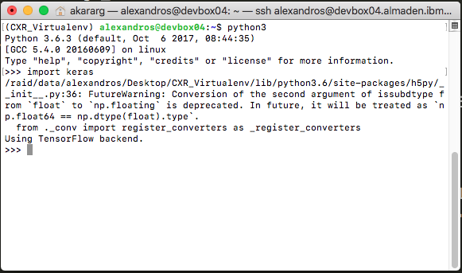
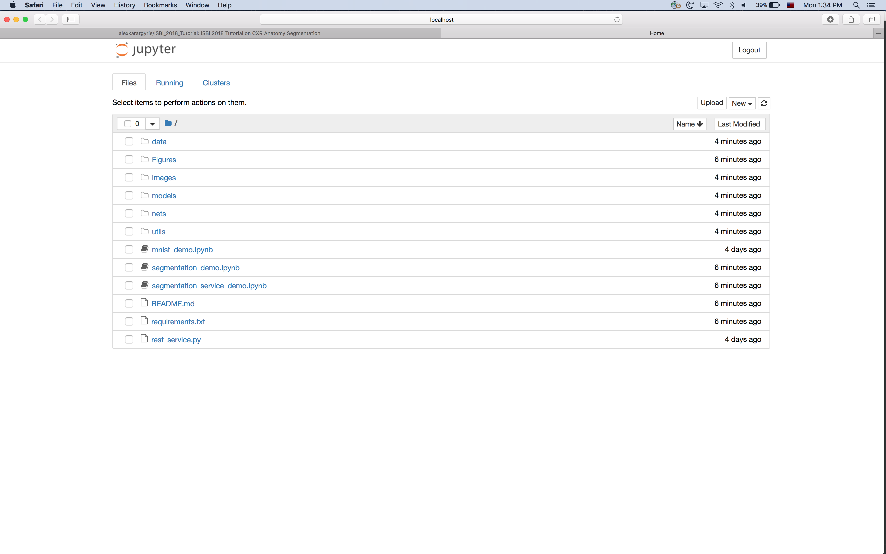

### Based on 2018-ISBI-tutorial: 
# Instructions

### Requirements
- A computer with Ubuntu/Mac/Windows operating system.
- High-speed internet access to download packages and repository
- Python 3.6 preferably, although it works with Python 2.7. 
> IMPORTANT!
> If you are using Windows machine, you need Python 3.6 since Tensorflow will not be able to install. We strongly recommend using your university's server or an AWS server with Linux instead. It comes with 750 hours of free computing: https://aws.amazon.com/ec2/
- VirtualEnv (see Linux/Mac instructions: https://virtualenv.pypa.io/en/stable/installation/, see example Windows instructions: http://timmyreilly.azurewebsites.net/python-pip-virtualenv-installation-on-windows/)

### Installation Steps

1. Create a folder e.g. `~/Desktop/axonSeg/` 
3. Create a VirtualEnv (e.g. `unet_env`) . To learn how to create a VirtualEnv and understand more here: https://virtualenv.pypa.io/en/stable/userguide/#usage
4. Activate your new VirtualEnv. To learn how to activate see more here: https://virtualenv.pypa.io/en/stable/userguide/#activate-script
5. Now that you are inside your virtual environment go to your folder e.g. `cd ~/Desktop/axonSeg/` 
6. From the terminal run `pip3 install -r requirements.txt` if your VirtualEnv is running Python3 or  `pip install -r requirements.txt` for Python2 to install the libraries. That might take a few minutes.
7. Once finished, make sure Keras/Tensorflow work (see figure below) by running `python3` for Python3 users (`python` for Python2 users ) and then inside the interpreter run `import keras`. See figure below.

8. Type `exit()` to exit the python interpreter. 

### Post-Installation Steps

1. TODO: will add links to input data...

